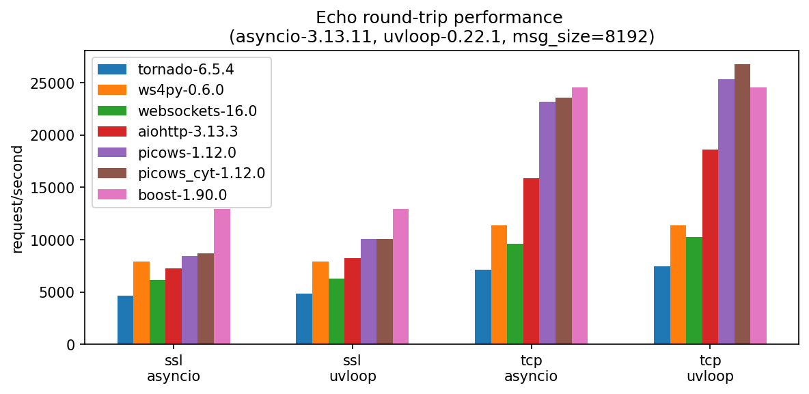
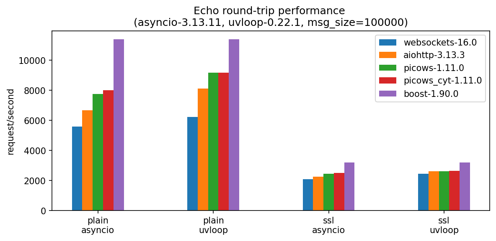

Method
================

.. _picows: https://github.com/tarasko/picows

.. _aiohttp: https://github.com/aio-libs/aiohttp

.. _websockets: https://github.com/python-websockets/websockets

.. _ws4py: https://github.com/Lawouach/WebSocket-for-Python

.. _tornado: https://github.com/tornadoweb/tornado

.. _c++ boost beast: https://github.com/boostorg/beast

.. _wsaccel: https://github.com/methane/wsaccel

This benchmark measures the latency of various Python asyncio-based WebSocket client libraries.

Each client connects to a WebSocket server over the loopback interface. The client sends a message of a specified size and waits for the response. Once the response is received, the client immediately sends the next message.

This request–response loop runs for a fixed period of time, after which the average requests per second (RPS) is calculated.

All clients are tested in the same environment and compared against the same high-performance C++ server.

Tested libraries: `picows`_, `aiohttp`_, `websockets`_, `ws4py`_, `tornado`_, `c++ boost beast`_ for reference.

Results (higher is better)
==========================

.. image:: results/benchmark-256.png
    :align: center

Tornado
=======
Not really a tornado when it comes to websockets. Can't say anything about HTTP though. This framework came consistently last across all async libraries. I briefly checked its source, they parse and build websocket frames in pure python, but apart from that I didn't notice anything super unusual. 

Ws4py
=======
First of all, this project seems to be NOT well maintained anymore. The author said so himself https://github.com/Lawouach/WebSocket-for-Python/issues/297.
Still I added it because it is quite popular and has >1k stars on github.

Second, I did ws4py synchronous client, it is not actually fair to compare it against async libraries that use event loops. Async libraries have almost always an extra system call for `select`, `epoll_wait` before reading data.
This extra system call introduce significant latency.

Third, **NEVER EVER USE py4ws WITHOUT** `wsaccel`_. ws4py has no C speedups for masking frame payload. It become 100 times slower than any other library when sending any websocket frames of medium size (8192 bytes)

Websockets
==========
A very popular websocket client library with the modern async interface. But for some reason significantly slower than its main competitor aiohttp. `aiohttp`_ offers similar features and a similar async interface, but it is just faster!
Users of `websockets`_ either don't care about performance at all, which is absolutely fine, it is Python after all. Or they are not aware of performance penalties. Or they need some specific features that aiohttp doesn't have.

Aiohttp
=======
The most famous asynchronous HTTP Client/Server with websockets support. They do quite well across all message sizes while providing async read/write interface. Nothing really to add here. I'd say it is a default choice if you just need a simple async websocket client.

Picows
======
All websocket frame building and parsing implemented completely in C. The library is very efficient with memory usage and tries to minimize memory coping and Python object creations.
The data interface is not async, it is simple callbacks through method overloading. 
This was a deliberate design choice:

- async interface introduces an extra hop through the event loop. The data is not immediately delivered to the user. First asyncio.Future is created and set and then event loop yields it on the next iteration.

- when data can be delivered immediately it doesn't have to be copied. User handlers can efficiently process read memory buffer directly through the memoryview.

- cython definitions are available. You can completely eliminate python vectorcall protocol when calling library methods on the most critical path.

If performance is your concern, you should definitely give it a try.

Boost.Beast
===========
I added C++ client to see how good python libraries perform in comparison with actual high perfomance C++ code. Suprisingly when message size is >2K picows + uvloop can be even faster than Beast.
After analyzing strace output I realized that Beast has made a dubious design decision. It always does first read with the maximum size of 1536 bytes. It is hardcode and afaik there is no option to change it.
So if you transmit frames bigger than roughly 1536 bytes Beast will always do 2 system calls to just read your data.
picows/uvloop has a bigger read buffer, so it is almost always a single system call.

Uvloop
======
Unfortunately, uvloop is not very well maintained anymore. It take years to get PRs merged, but it is still a little faster than vanilla asyncio from Python-3.13.

Build C++ Boost.Beast websocket echo server and client
======================================================

1. Create or reuse some python virtual environment. I use conda environments but it could be anything.

.. code-block::

  $ conda create -n wsbench
  $ conda activate wsbench

2. Install conan. Conan is a C++ package manager (simular to pip).

.. code-block::

  $ pip install conan

3. Initialize conan default profile

.. code-block::

  $ conan profile detect

4. Install C++ dependencies, create build project using default cmake generator.

.. code-block::

  $ conan install . --output-folder=build --build=missing
  $ cd build
  $ cmake .. -DCMAKE_TOOLCHAIN_FILE=conan_toolchain.cmake -DCMAKE_BUILD_TYPE=Release
  # Go back to the root folder
  $ cd ..

5. Build server and client

.. code-block::

  $ cmake --build ./build --parallel

6. Run websocket echo server. Must be run from the project root folder, otherwise it will complain about missing certificate. Server will listen on 2 ports, 9001: plain websocket, 9002: ssl websocket

.. code-block::

  $ ./build/src/ws_echo_server 127.0.0.1 9001 9002

7. Test websocket echo client. Must be run from the project root folder. After succeful run, the client will dumpl RPS to stdout.
  Usage: ws_echo_client <is_async{1|0} is_secure{1|0}> <host> <port> <msg_size> <duration_sec>

.. code-block::

  ./build/src/ws_echo_client 1 0 127.0.0.1 9001 256 10

Build python benchmark
======================

1. Install dependencies

.. code-block::

  $ pip install -r requirements.txt

2. Compile cython extensions

.. code-block::

  $ python setup.py build_ext --inplace

3. Run benchmark for 256 message size, 10 seconds duration per client. Run it from the project root folder. ws_echo_server should be run manually prior to running benchmark.

.. code-block::

  $ python -m websocket_benchmark.benchmark --msg-size 256 --duration 10

Contribute
==========

Feel free to add other libraries to this benchmark. PRs are welcome!

